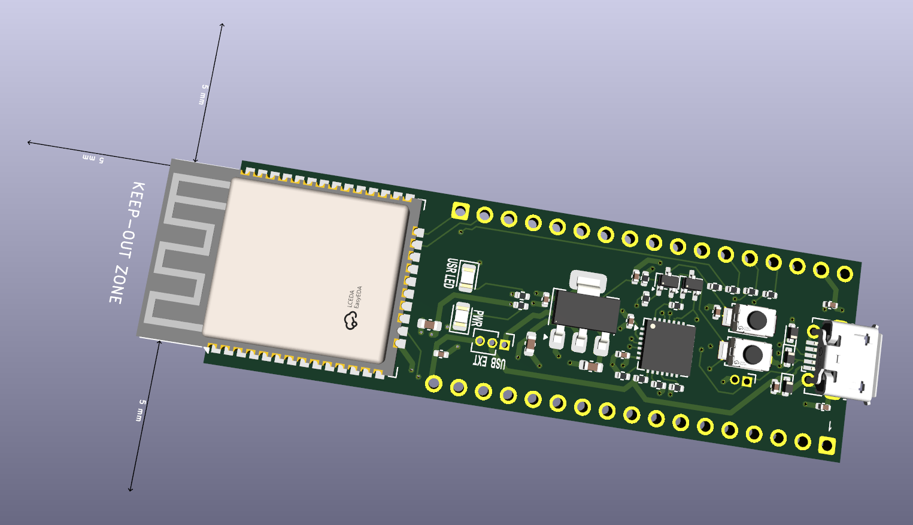
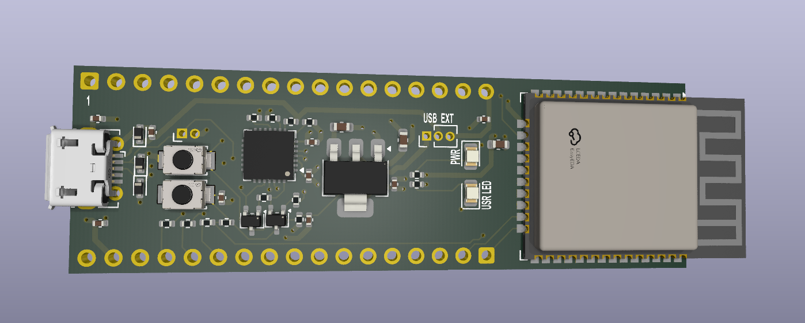
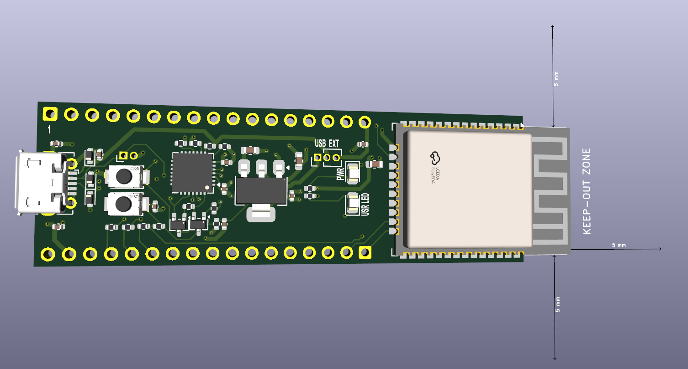
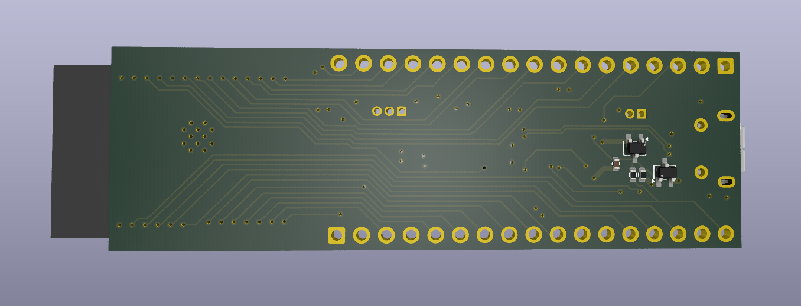
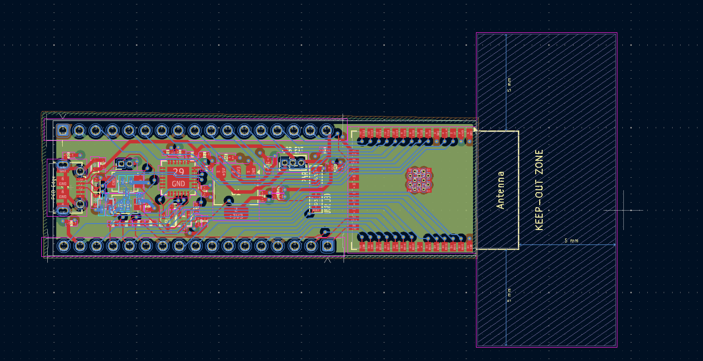
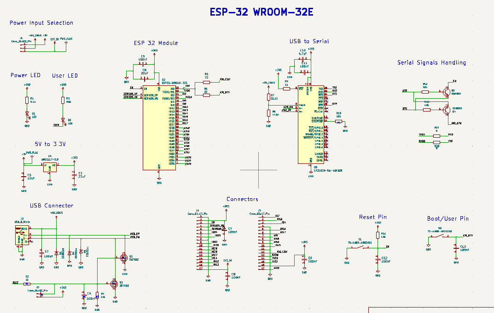

# Custom ESP32 Development Board

A from-scratch ESP32-WROOM-32E development board designed in KiCad 9.0.7 on a 4-layer PCB stackup.








## Features

- **MCU:** ESP32-WROOM-32E (WiFi + Bluetooth, dual-core Xtensa LX6)
- **USB-to-Serial:** CP2102N-A02-GQFN28 with full auto-programming support (DTR/RTS via 2N7002 MOSFETs)
- **Power:** AMS1117-3.3V LDO with 22µF + 100nF input/output filtering; external 5V input option with power path selection
- **ESD Protection:** ESD5Zxx TVS diodes on USB D+/D- lines
- **User Interface:** Boot button, Reset button, Power LED, User LED
- **I/O:** Dual 17-pin headers — breadboard-compatible, exposing all usable GPIOs
- **RF:** Antenna keep-out zone with 5mm clearance on all sides — no copper pour under antenna area
- **PCB:** 4-layer stackup (Signal – GND – Power – Signal), designed for clean return paths and RF performance

## Schematic Overview

| Block | Key Components | Notes |
|---|---|---|
| ESP32 Module | ESP32-WROOM-32E | 38 pins exposed via castellated pads |
| USB-to-Serial | CP2102N, 2N7002 × 2 | Auto-reset circuit for one-click flashing |
| Power Regulation | AMS1117-3.3, SS8050 | 5V USB or external → 3.3V rail |
| ESD Protection | ESD5Zxx × 2 | On USB data lines |
| Decoupling | 100nF × 8, 22µF × 2, 10µF, 4.7µF | Distributed across power pins |

## 4-Layer Stackup Rationale

| Layer | Function |
|---|---|
| F.Cu | Signal routing + component pads |
| In1.Cu | Continuous ground plane |
| In2.Cu | Power distribution (3.3V, 5V) |
| B.Cu | Signal routing + component pads |

A dedicated ground plane on layer 2 ensures low-impedance return paths for high-speed USB signals and minimises EMI. Separating power onto its own inner layer reduces noise coupling to signal traces.

## Design Decisions

- **Auto-reset circuit:** Uses two 2N7002 N-channel MOSFETs driven by DTR and RTS from the CP2102N. This allows tools like `esptool.py` to automatically put the ESP32 into bootloader mode — no manual button pressing needed during upload.
- **Antenna keep-out:** 5mm clearance enforced on all sides of the ESP32 antenna area. No copper, traces, or components in this zone to preserve WiFi/Bluetooth performance.
- **External 5V input:** A 3-pin header (J1) allows powering the board from an external 5V source (e.g., battery pack or bench supply) independently of USB, with SS8050-based switching.
- **Pull-up/pull-down network:** Strapping pins (IO0, IO2, IO5, IO15) are configured via resistor network for default boot-from-flash behaviour.

## Repository Structure

```
Custom_ESP_Dev_Board/
├── hardware/                      # KiCad project files (.kicad_pro, .kicad_sch, .kicad_pcb)
├── production/
│   ├── gerbers/                   # Fabrication files
│   ├── BOM.csv                    # Bill of Materials
│   └── pick-and-place.csv        # Assembly positions
├── docs/
│   ├── images/                    # 3D renders, PCB layout, schematic screenshots
│   └── schematic.pdf             # Exported schematic PDF
├── LICENSE
└── README.md
```

## Tools Used

- **EDA:** KiCad 9.0.7
- **PCB Layers:** 4
- **Design Rules:** JLCPCB 4-layer capabilities (adjust as needed for your fab)

## Getting Started

1. Clone this repo
2. Open the `.kicad_pro` file in KiCad 9.0.7+
3. Generate Gerbers from PCB editor → File → Fabrication Outputs
4. Upload to your preferred PCB fab (JLCPCB, PCBWay, etc.)

## References

- [ESP32-WROOM-32E Datasheet](https://www.espressif.com/sites/default/files/documentation/esp32-wroom-32e_esp32-wroom-32ue_datasheet_en.pdf)
- [ESP32-DevKitC V4 Reference Schematic](https://dl.espressif.com/dl/schematics/esp32_devkitc_v4-sch.pdf)
- [CP2102N Datasheet](https://www.silabs.com/documents/public/data-sheets/cp2102n-datasheet.pdf)

## Licence

This project is open-source hardware. See [LICENSE](LICENSE) for details.

---

Designed by **Ghous Ali** — Electronics & Embedded Systems Engineer  
[LinkedIn](https://www.linkedin.com/in/YOUR-PROFILE) · [Email](mailto:your@email.com)
